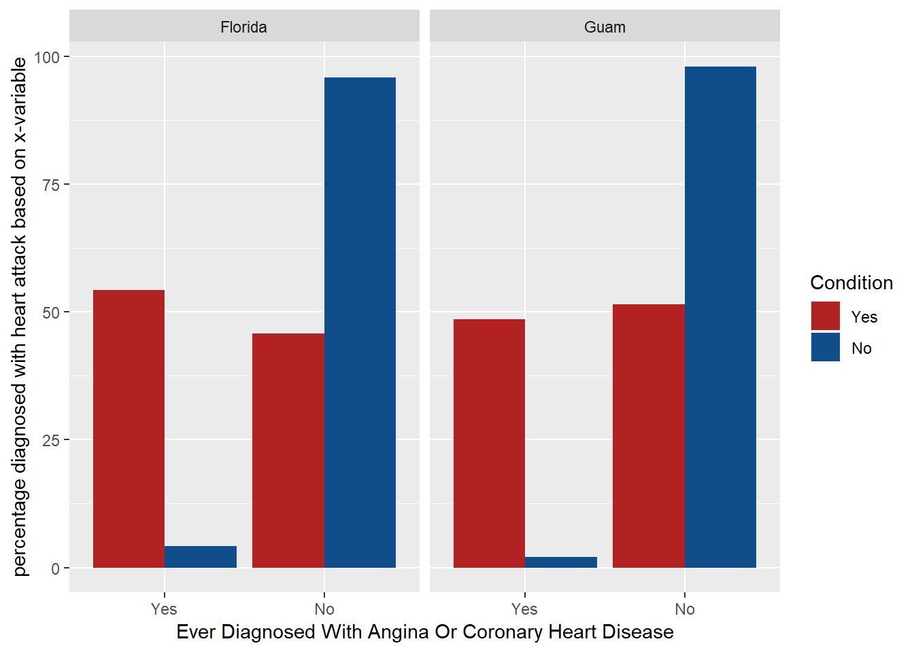

# Week 4 - Project - Exploring the BRFSS data by Akshay Kotha {-}

Refer /brfss_codebook.html for details on the BRFSS variables.

---
title: "Exploring the BRFSS data by Akshay Kotha"
output: 
  html_document: 
    fig_height: 4
    highlight: pygments
    theme: spacelab
---

## Setup

### Load packages


```r
library(ggplot2)
library(dplyr)
library(statsr)
```

### Load data


```r
load("brfss2013.RData")
```


* * *

## Part 1: Data
There are two types of observations in general. 1. Data collected via landline telephone interviews. 2. Data collected via cellular phone interviews. It is also mentioned that all the responses were self-reported which is similar to volunteering to answer the questionnairre. When it comes to landline telephone interviews, disproportionte stratified sampling(DSS) was done which implies the results would be representative of entire population. DSS might have been done to cater for the need to represent the entire population. When it comes to cellular phone interviews, it is mentioned that random sampling took place. Based on this, the results and analysis obtained can be generalized to the US population or a population with similar characteristics because the random samples are representative of the entire population across all the states of the US. In both cases, causality cannot be inferred as this is only an observational study which has non-response bias and nowhere it was mentioned that random assignment was done.

* * *

## Part 2: Research questions

### Research quesion 1: 
**Relation between height(htin4), weight (wtkg3) and 'joinpain' (how bad was joint pain?)Describe the distributions and which probabilistic distributions are skewed (positively or negatively/ right or left) - Distribution of  Height(inches) htin4 w.r.t 'joinpain' or wtkg3 w.r.t 'joinpain'? **

This is of interest because it helps understand to decide on which variable to use for predictive modelling. If the variables are highly skewed, they have to be transformed and then used to get accurae predictions.

* * *

### Research quesion 2: 
**Relation between people who have coronary heart disease (cvdcrhd4) and those who are diagnosed with heartattack (cvfinfr4) using comparison between states of maximum adnd minimum respondents?**

Association of two same organ ailments would be helpful in whether both have to be treated separately or together. The check of whether this varies across different states is to understand whether it matters if the people are located in one state over the other. It can be understood whether '_state' variable has any association. For instance if it really varies between different states, more variables can be thought about from within the data or externally during the causal analysis.

* * *
### Research quesion 3:
**Are frequency of feeling depressed in the past days (misdeprd), difficulty in concentrating or remembering (decide) are associated or dependent?**

Correlation finding is useful as this is an observational study and eventually might help in finding stronger evidence for causality (only after carrying some random experiments but not from this study solely). 

* * *

## Part 3: Exploratory data analysis

### Research quesion 1: Code


```r
#checking the type of variable
str(brfss2013$wtkg3)
```

```
##  int [1:491775] 11340 5761 7257 5806 12020 10206 4808 NA 10659 7711 ...
```

```r
str(brfss2013$htin4)
```

```
##  int [1:491775] 67 70 64 64 72 63 60 65 74 65 ...
```

```r
str(brfss2013$joinpain)
```

```
##  int [1:491775] 7 NA 5 NA NA NA 3 8 4 NA ...
```

```r
#creating new df so that there are no 'NA' values in the varibles under consideration
brfss_joinpain <- brfss2013 %>%
  filter(!is.na(joinpain),!is.na(htin4), !is.na(wtkg3)) %>%
  mutate(wtkg3_actual = wtkg3/100) ##Assumption: The calculated weight variable wtkg3 divided by 100 makes sense hence added new variable wtkg3_actual 

#str(brfss_joinpain$wtkg3_actual)
  
#converting int values of levels in 'joinpain' to factor so that they can be ordered properly in denotion
brfss_joinpain[, 'joinpain']  <- factor(brfss_joinpain[,'joinpain'])
str(brfss_joinpain$joinpain)    #%>%
```

```
##  Factor w/ 11 levels "0","1","2","3",..: 8 6 4 5 9 6 5 3 8 8 ...
```

```r
#TO get an idea of summary statistics of heights  
brfss_joinpain %>%
  group_by(joinpain) %>%
  summarise(count=n(), mean_height = mean(htin4), median_ht = median(htin4), min_ht = min(htin4), max_ht = max(htin4), iqr_ht = IQR(htin4), sd_ht = sd(htin4), var_ht = var(htin4))
```

```
## # A tibble: 11 x 9
##    joinpain count mean_height median_ht min_ht max_ht iqr_ht sd_ht var_ht
##    <fct>    <int>       <dbl>     <dbl>  <dbl>  <dbl>  <dbl> <dbl>  <dbl>
##  1 0        10658        66.4        66     40     87      7  4.18   17.5
##  2 1         8716        66.7        66     48     83      6  4.09   16.7
##  3 2        14330        66.7        66      2     81      6  4.08   16.6
##  4 3        17800        66.5        66     36     92      6  4.03   16.3
##  5 4        15440        66.2        66     48     83      6  4.03   16.2
##  6 5        22675        65.8        65     41     87      5  4.00   16.0
##  7 6        12169        66.0        66     45     85      6  4.10   16.8
##  8 7        13073        66.4        66     48   6123      6 53.1  2823. 
##  9 8        14739        65.6        65     38     86      5  4.08   16.7
## 10 9         3728        65.5        65     50     84      5  4.07   16.6
## 11 10        8252        65.0        64     48     90      5  3.95   15.6
```


```r
#To get an idea of summary stats of weights (kg)
brfss_joinpain %>%
  group_by(joinpain) %>%
  summarise(count=n(), mean_wt = mean(wtkg3_actual), median_wt = median(wtkg3_actual), min_wt = min(wtkg3_actual), max_wt = max(wtkg3_actual), iqr_wt = IQR(wtkg3_actual), sd_wt = sd(wtkg3_actual), var_wt = var(wtkg3_actual))
```

```
## # A tibble: 11 x 9
##    joinpain count mean_wt median_wt min_wt max_wt iqr_wt sd_wt var_wt
##    <fct>    <int>   <dbl>     <dbl>  <dbl>  <dbl>  <dbl> <dbl>  <dbl>
##  1 0        10658    79.7      77.1  25.0    231.   25.4  20.3   410.
##  2 1         8716    79.4      77.1  36.3    209.   25.0  19.2   368.
##  3 2        14330    81.1      79.4   0.02   213.   22.7  19.4   378.
##  4 3        17800    81.7      79.4  31.8    290.   24.5  20.1   403.
##  5 4        15440    82.0      79.4  25.0    250    24.9  21.0   441.
##  6 5        22675    81.3      78.5  22.7    272.   24.0  20.9   435.
##  7 6        12169    83.9      81.6  24.5    261.   27.2  22.6   511.
##  8 7        13073    85.3      81.6   0.02   272.   29.5  23.1   532.
##  9 8        14739    84.8      81.6  24.5    263.   29.5  23.7   562.
## 10 9         3728    86.8      82.6  36.3    207.   29.9  24.6   604.
## 11 10        8252    84.4      81.2  24.0    272.   29.0  24.0   578.
```


```r
#plot probability distributions by categorical level of the variable 'joinpain' for height
#dim(brfss_joinpain)
ggplot(brfss_joinpain, aes(x = htin4, colour = joinpain)) + geom_density() + labs(x = "height (inches)", y = "prob_density")
```


```r
#plot probability distributions by categorical level of the variable 'joinpain' for weight

ggplot(brfss_joinpain, aes(x = wtkg3_actual, colour = joinpain)) + geom_density() + labs(x = "weight (kg)", y = "prob_density")
```


### Narrative of question 1:
With respect to own scales of the above two plots, distributions of heigts and weights across categories of the joinpain variable are both right skewed. Skewness of both the plots can be verified with the summary statistics calculated before the plots were made. Both of them need further adjustment via normalization(not understood completely, out of scope for this course) or other techniques to use them in the predictive models for higher accuracy.

***


### Research quesion 2: Code


```r
#check variable type
str(brfss2013$cvdinfr4)
```

```
##  Factor w/ 2 levels "Yes","No": 2 2 2 2 2 2 2 2 2 2 ...
```

```r
str(brfss2013$cvdcrhd4)
```

```
##  Factor w/ 2 levels "Yes","No": NA 2 2 2 2 2 2 1 2 2 ...
```

```r
str(brfss2013$X_state)
```

```
##  Factor w/ 55 levels "0","Alabama",..: 2 2 2 2 2 2 2 2 2 2 ...
```

```r
#_state is not allowed, so replacement is done
grep("state", names(brfss2013), value = TRUE)
```

```
## [1] "X_state"  "stateres" "cstate"
```


```r
# number of respondents grouped by state
statewise_count <- brfss2013 %>%
  group_by(X_state) %>%
  summarise(count = n())

  #arrange(desc(countX_state))
#finding the descending order
statewise_count %>%
  #summarise(max(count), min(count))
  arrange(desc(count))
```

```
## # A tibble: 55 x 2
##    X_state       count
##    <fct>         <int>
##  1 Florida       33668
##  2 Kansas        23282
##  3 Nebraska      17139
##  4 Massachusetts 15071
##  5 Minnesota     14340
##  6 New Jersey    13776
##  7 Colorado      13649
##  8 Maryland      13011
##  9 Utah          12769
## 10 Michigan      12761
## # ... with 45 more rows
```


```r
# new dataframe creation for the purpose of answering this specific question
brfss_heartattack <- brfss2013 %>%
  filter(!is.na(cvdinfr4),!is.na(cvdcrhd4), X_state %in% c("Florida","Guam")) 

#New variable to get percentage in the plots based on select variable
brfss_heartattack %>%
  group_by(X_state, cvdinfr4, cvdcrhd4) %>%
  summarise(count = n()) %>%
  mutate(percentage_count = 100 * count/sum(count)) %>%

#plot coronary heart disease along x axis, cvdinfr4 in a different colour
ggplot(aes(x=cvdcrhd4, y = percentage_count, fill=cvdinfr4)) +
#plot cvdinfr4 alongside cvdcrhd4 ("dodge", alternatively use "stack") and make #a seperate graph for both values of cvdcrhd4
geom_bar(stat = "identity",position = "dodge") + 
  # To split across the states considered
  facet_wrap(~X_state) + 
  # Beautify with color codes
  scale_fill_manual("Condition", values = alpha( c("firebrick", "dodgerblue4"), 1) ) + 
  labs(x = "Ever Diagnosed With Angina Or Coronary Heart Disease", y = "percentage diagnosed with heart attack based on x-variable")
```



### Narrative of question 2: 
The X_state variable is not associated with the link between diagnosing with heart attack based on having coronory heart disease because no matter the state has maximum respondents (Florida) or minimum respondents (Guam), the proportions of those who are diagnosed with coronory heart disease are also diagnosed with heart attack are almost same. Implicity, there is an association between having coronoary heart disease and not having coronoary heart disease with having a heart attack. Hence, variable x is associated with the heart attack condition but state variable is not associated with the correlation of earlier two. Summary statistics answering this question is out of scope for this question because it is an analysis between categorical variables.


***

### Research quesion 3: Code 

```r
#checking variable type
str(brfss2013$misdeprd)
```

```
##  Factor w/ 5 levels "All","Most","Some",..: 5 5 5 5 NA NA NA NA NA NA ...
```

```r
str(brfss2013$decide)
```

```
##  Factor w/ 2 levels "Yes","No": 2 2 2 2 2 2 2 2 2 2 ...
```

```r
#data frame without NAs for the variables under consideration
brfss_dep_conc <- brfss2013 %>%
  filter(!is.na(misdeprd),!is.na(decide)) 
  
  #group_by(misdeprd, decide) %>%
  #summarise(n())

#stacked bar plot
ggplot(brfss_dep_conc, aes(x = misdeprd)) + geom_bar(aes(fill = decide), position = 'fill') + labs(x = "How Often Feel Depressed Past 30 Days", y = "proportion of Yes/No for having diffculty concentrating")
```


### Narrative question 3: 
The stacked bar plot above shows that there is a clear association (dependency) between DECIDE and MISDEPRD. There is an increasing trend for proportion of people who didn't face difficulty in concentrating or remembering (decide) in each category of the variable on x-axis (How often people were depressed in the last 30 days) from left to right. Summary statistics answering this question is out of scope for this question because it is an analysis between categorical variables.

